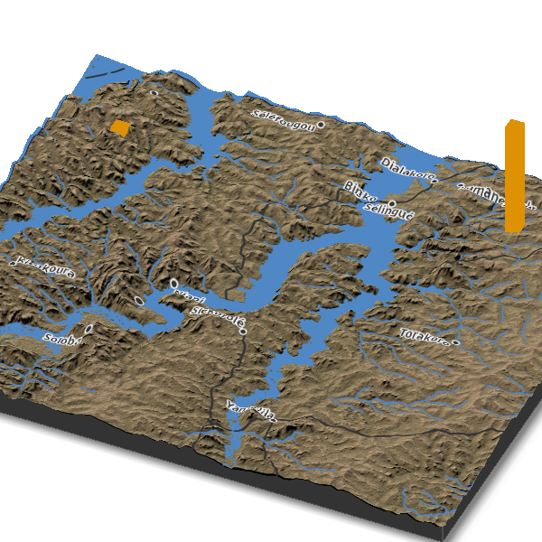
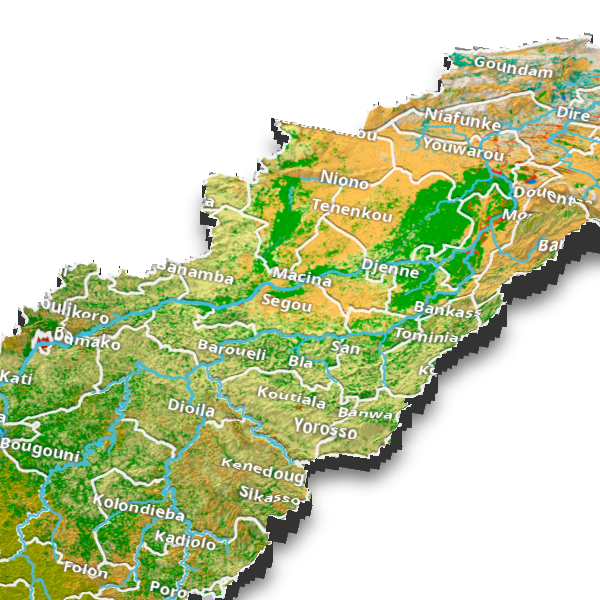
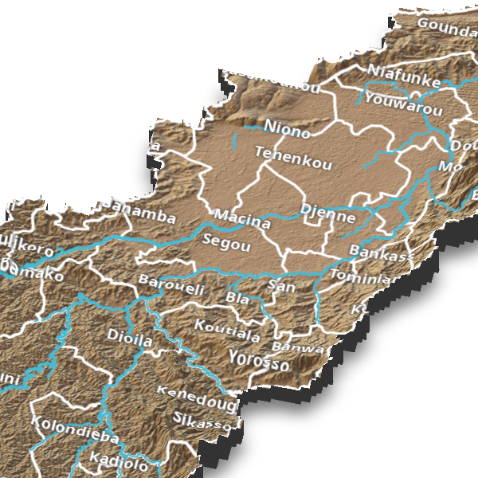

::: {.note .text-serif .mt-2}
This post contains WebGL widgets which may be SLOW to render on older GPUs.
:::

```{r}
#| label: setup
#| code-fold: true

library(scales)
library(stringr)
library(data.table)
library(terra)
library(osmdata)
library(rayshader)
library(rgl)

# Restore session data
if (interactive()) {
  setwd("./posts/2021-10-24-3dmap/")
}
load("./_data/3dmap-01.RData")

# External data
root = "/run/media/mbacou/Backup MB/WADashboard"

# Colors
pal = readRDS("./_data/pal_iwmi.rds")
par(font.main = 1, font.sub = 1, cex.axis = .8)
```

Aside from rendering topography and water streams in 3D (and potentially other covariate layers), our objective is to overlay custom labels to illustrate the water cycle.

Another objective is to provide basin and sub-basin statistics, starting with precipitation, ET, soil moisture, and adding other covariates, such as population, land use allocation, and crop allocation.

Some inspiration below:

- Tyler Morgan [Tutorial: Adding OSM Data to Rayshader Maps](https://www.tylermw.com/adding-open-street-map-data-to-rayshader-maps-in-r/)
- [Flood depth on 3D terrain](https://observablehq.com/@sw1227/flood-depth-map-on-3d-terrain?collection=@sw1227/geo)
- Procedural-gl [examples](https://www.procedural.eu/)
- [Cesium](https://sandcastle.cesium.com/?src=Globe%20Materials.html) platform for 3D Geospatial
- [NASA Web WorldWind](https://worldwind.arc.nasa.gov/web/examples/#anchor)
- [WebGL with Google Maps API](https://cloud.google.com/blog/products/maps-platform/using-new-webgl-powered-maps-features) on how to construct and render 3D scenes with WebGL.

```{r}
#| echo: false
#| layout-ncol: 2
#| column: page-right
#| fig-cap: Visual inspiration

list.files("./_fig", full.names = TRUE)[c(1, 5)] |>
  knitr::include_graphics()
```

# WebGL: Sample Scene Processing with Rayshader

See rayshader documentation[^rgl] for details.

[^rgl]: https://rayshader.com/

## Data Acquisition

We’ll experiment with a smaller sample scene of the Selingue Dam in the Niger River basin.

```{r}
#| eval: true

basin = vect(file.path(root, "./mli/srtm/mli_basin.shp"))
zoi = vect(file.path(root, "./mli/srtm/zoi.shp"))
ext = ext(zoi)
center = centroids(zoi) |> crds()

# Get CGIAR SRTM DEM at 90m
srtm = geodata::elevation_3s(center[, "x"], center[, "y"], path = "_data") |>
  crop(zoi) |>
  mask(zoi)
srtm

# Get satellite basemap
bmap = maptiles::get_tiles(ext, "Esri.WorldImagery", zoom = 10) |>
  crop(zoi) |>
  mask(zoi)
```

The basin covers a large area, so we would need 8 SRTM tiles, but 1 is enough for a proof of concept. Next we’ll get a satellite basemap.

```{r}
#| layout-ncol: 3
#| column: page-right

plot(basin, col = pal[2], border = pal[1], lwd = 2, main = "Niger River Basin (Mali)")
plot(zoi, lty = 3, col = alpha(pal["red"], .6), border = pal["red"], lwd = 2, add = T)
text(-8, 10.5, "Selingue Dam\n(Mali)", col = pal["red"], cex = .7, font = 2)
grid()

plot(ext, main = "Selingue Dam (Mali) - ESRI World Imagery")
plotRGB(bmap, add = T)
grid(col = "white")
plot(srtm, main = "Selingue Dam (Mali) - SRTM 90m")
grid(col = "white")
```

## Scene Rendering

Next we convert the 2 rasters to a matrix format that is compatible with Rayshader hillshading and raytracing algorithms.

```{r}
#| eval: false

# Convert rasters to rayshader matrix format
srtm_array = raster_to_matrix(srtm)

# Convert sat basemap to matrix (test)
r = raster_to_matrix(bmap$red)
g = raster_to_matrix(bmap$green)
b = raster_to_matrix(bmap$blue)

bmap_array = array(0, dim = c(nrow(r), ncol(r), 3))
bmap_array[,, 1] = r / 255
bmap_array[,, 2] = g / 255
bmap_array[,, 3] = b / 255

bmap_array |>
  aperm(c(2, 1, 3)) |>
  # Stretch contrast
  scales::rescale(to = c(0, 1)) -> bmap_array

rm(bmap, r, g, b)
```

## Terrain Overlay

2D view of the generated basemap with satellite image overlay.

```{r}
#| fig-cap: Hillshaded Basemap of Selingue Dam (Niger River basin)

srtm_water = srtm_array
srtm_water[srtm_water < 353] = 0

base_map_sat = srtm_array |>
  height_shade() |>
  add_overlay(bmap_array) |>
  add_shadow(ray_shade(srtm_array, zscale = 90)) |>
  add_water(detect_water(srtm_water), color = alpha(pal["blue"], 0.4))

plot_map(base_map_sat)
```

That doesn’t look very clear, so instead we’ll create a basemap, not using the satellite image but a built-in texture.

```{r}
#| eval: false

base_map = srtm_array |>
  sphere_shade(texture = "desert", zscale = 4, colorintensity = 5) |>
  add_overlay(height_shade(srtm_array), alphalayer = 0.5) |>
  add_shadow(lamb_shade(srtm_array, zscale = 6), 0) |>
  add_shadow(ambient_shade(srtm_array), 0) |>
  add_shadow(
    texture_shade(srtm_array, detail = 8 / 10, contrast = 9, brightness = 11),
    0.1
  ) |>
  add_water(detect_water(srtm_water), color = alpha(pal["blue"], 0.4))
```

```{r}
#| fig-cap: Hillshaded Basemap of Selingue Dam

plot_map(base_map)
save_png(base_map, "_data/base_map.png")
```

Looks better, so let’s acquire and overlay spatial features from OSM. Note that water-related features for Niger and Mali are scarcely available from OSM, but most waterways are recorded.

## OSM Overlays

```{r}
#| eval: false

bbox = ext[c(1, 3, 2, 4)]

osm_roads = opq(bbox, osm_types = "way") |>
  add_osm_feature("highway", "primary") |>
  osmdata_sf()

osm_water = opq(bbox, osm_types = "way") |>
  add_osm_feature("water") |>
  osmdata_sf()

osm_waterway = opq(bbox, osm_types = "way") |>
  add_osm_feature("waterway") |>
  osmdata_sf()

osm_place = opq(bbox, osm_types = "node") |>
  add_osm_feature("place", c("", "")) |>
  osmdata_sf()
```

```{r}
#| eval: false

# Or use OSM features acquired in QGIS instead
osm_roads = vect(file.path(root, "./mli/srtm/osm_roads.shp")) |> crop(zoi)
osm_water = vect(file.path(root, "./mli/srtm/osm_water.shp")) |> crop(zoi)
osm_place = vect(file.path(root, "./mli/srtm/osm_place.shp")) |> crop(zoi)
```

We then overlay selected OSM features onto our previous scenes.

```{r}
#| fig-cap: 2D view of Selingue Dam (Mali) with OSM features

# Read the image file from your system
img = rast("_data/base_map.png")
ext(img) = ext(zoi)

# Draw the image onto the specified coordinates (xleft, ybottom, xright, ytop)
plot(ext)
plotRGB(img, add = T)
plot(osm_water, col = pal["navy"], lwd = 2, lty = 2, add = T)
plot(osm_roads, col = pal["red"], lwd = 3, lty = 1, add = T)
plot(osm_place, col = pal["red"], add = T)
text(
  osm_place,
  "name",
  col = pal["red"],
  pos = 3,
  cex = 1,
  halo = TRUE,
  hc = "white"
)
grid(col = "white")
```

Now, we use **rayshader** utilities to generate 3D layer overlays.

```{r}
#| eval: false

road_layer = generate_line_overlay(
  sf::st_as_sf(osm_roads),
  extent = ext,
  srtm_array,
  linewidth = 5,
  color = pal["black"]
)

water_layer = generate_line_overlay(
  sf::st_as_sf(osm_water),
  extent = ext,
  srtm_array,
  linewidth = 3,
  color = pal["blue"]
)

place_layer = generate_label_overlay(
  sf::st_as_sf(osm_place),
  extent = ext,
  heightmap = srtm_array,
  font = 2,
  text_size = 1.6,
  point_size = 1.6,
  color = pal["black"],
  halo_color = "white",
  halo_expand = 2,
  halo_blur = 1,
  halo_alpha = .9,
  seed = 1,
  data_label_column = "name"
)
```

Finally we’ll use WebGL to render this scene in 3D. We also test adding 3D polygon (bar) annotations.

```{r}
#| eval: false

scene1 = base_map |>
  #scene <- base_map_sat |>
  add_overlay(road_layer) |>
  add_overlay(water_layer, alphalayer = 1) |>
  add_overlay(place_layer)

base_map_alt = srtm_array |>
  texture_shade(detail = 8 / 10, contrast = 9, brightness = 11) |>
  add_overlay(height_shade(srtm_array), alphalayer = 0.5) |>
  add_shadow(ambient_shade(srtm_array, zscale = 1 / 5), 0)

scene2 = base_map_alt |>
  add_overlay(road_layer) |>
  add_overlay(water_layer, alphalayer = 1) |>
  add_overlay(place_layer)

rm(img)
save.image("./_data/3dmap-01.RData")
```

```{r}
#| eval: false

scene1 |>
  plot_3d(
    resize_matrix(srtm_array, 1 / 10),
    zscale = 20,
    theta = 30,
    phi = 20,
    fov = 0,
    zoom = 0.5,
    shadowcolor = pal["black"],
    solidcolor = pal["black"]
  )

# Add sample polygon annotations
xyz = sf::read_sf(file.path(root, "./mli/srtm/xyz.shp"))
render_polygons(
  xyz,
  ext,
  data_column_top = "z",
  scale_data = 1,
  color = alpha(pal["orange"], 0.8),
  lit = F,
  light_intensity = 0.01,
  clear_previous = T
)

render_snapshot("_fig/scene.png", print_scene_info = TRUE)
htmlwidgets::saveWidget(rglwidget(), file = "_out/scene.html", selfcontained = TRUE)
close3d()
```

```{r}
#| fig-cap: Interactive 3D Scene of Selingue Dam


```

::: {.aside .note}
The generated interactivve scene (PNG images and associated JS code) is 3.5MB.

<a role="button" class="btn btn-secondary" href="_out/scene.html" target="_blank"><i class="bi bi-badge-3d-fill"></i> 3D Scene</a>
:::


# WebGL: Full Scene with Rayshader

Following the approach above, we experiment with a 3D scene for the entire Niger River basin area, our ZOI for the WA+ study.

## Data Acquisition

```{r}
#| eval: true

# Basin boundaries from IWMI
zoi = vect(file.path(root, "./mli/srtm/mli_basin.shp"))
ext = ext(zoi)
center = centroids(zoi) |> crds()

# GAUL admin-2 boundaries
adm = vect(file.path(root, "./mli/srtm/mli_adm2_lines.shp"))
places = vect(file.path(root, "./mli/srtm/mli_adm2_centroids.shp"))

# CGIAR SRTM DEM (upsampled)
alt = lapply(c("MLI", "GIN", "CIV"), function(x) {
  geodata::elevation_30s(x, path = "_data") |>
    crop(zoi) |>
    mask(zoi)
})
alt = mosaic(alt[[1]], alt[[2]], alt[[3]], fun = mean)
writeRaster(alt, file.path(root, "./mli/srtm/mli_alt.tif"), overwrite = T)
alt

# ESA WorldCover (clipped in QGIS)
#luc = rast(file.path(root, "./shared/mli/srtm/ESA WorldCover clip.tiff")

# Note that I can't find a colormap for this raster, so switching to ESA CCI instead
luc = rast(file.path(root, "./mli/srtm/mli_esa_cci_300m.tif"))

# And its colormap
pal.luc = fread(file.path(root, "./mli/srtm/ESA CCI Colormap.csv"))

# We'll use GloRIC v1.0 stream network instead of OSM
# Features are filtered to `Class_hydr > 12`
gloric = vect(file.path(root, "./mli/srtm/mli_gloric_filtered.shp"))
```

```{r}
#| fig-cap: Niger River Basin (Mali)
#| layout-ncol: 2

plot(alt, main = "Niger River Basin (Mali) - SRTM 30s (meter)")
plot(adm, lty = 3, col = "white", lwd = 1, add = T)
plot(gloric, col = pal["blue"], lwd = .4, add = T)
grid()

plot(
  luc,
  col = pal.luc$hex,
  breaks = pal.luc$value,
  legend = F,
  main = "Niger River Basin (Mali) - ESA CCI 300m"
)
plot(adm, lty = 3, col = pal["black"], lwd = 1, add = T)
grid()
legend(
  .5,
  18,
  legend = pal.luc$label,
  fill = pal.luc$hex,
  bty = "n",
  cex = .7,
  pt.cex = 4,
  xpd = T
)
```

## Scene Rendering

Same approach and configuration as in the smaller ZOI above.

### 2D Scene Rendering

```{r}
#| eval: false

# Convert DEM to rayshader matrix format
srtm_array = raster_to_matrix(alt)

luc = raster::raster(file.path(root, "mli/srtm/mli_esa_cci_300m.tif"))
bmap = raster::RGB(luc, col = pal.luc$hex, breaks = c(0, pal.luc$value))

# Convert land cover raster to matrix
r = raster_to_matrix(bmap$red)
g = raster_to_matrix(bmap$green)
b = raster_to_matrix(bmap$blue)

bmap_array = array(0, dim = c(nrow(r), ncol(r), 3))
bmap_array[,, 1] = r / 255
bmap_array[,, 2] = g / 255
bmap_array[,, 3] = b / 255

bmap_array = bmap_array |>
  aperm(c(2, 1, 3)) |>
  # Stretch contrast
  scales::rescale(to = c(0, 1))

rm(bmap, r, g, b)
```

2D scene rendering of the generated basemap with land cover overlay.

```{r}
#| eval: false

# Build scene (long step)
base_map_luc = srtm_array |>
  height_shade() |>
  add_overlay(bmap_array) |>
  add_shadow(lamb_shade(srtm_array, zscale = 6), 0.5) |>
  add_shadow(ambient_shade(srtm_array), 0.5)

saveRDS(base_map_luc, "./_data/base_map_luc_basin.rds")
```

The choice of hillshading parameters below might need tweaking.

```{r}
#| eval: false

base_map = srtm_array |>
  sphere_shade(texture = "desert") |>
  #add_shadow(ray_shade(srtm_array, zscale=50))
  add_shadow(lamb_shade(srtm_array, zscale = 6), 0.5) |>
  # This step takes up to 5min on 4 cores / 8GB
  add_shadow(ambient_shade(srtm_array), 0.5)

saveRDS(base_map, "./_data/base_map_basin.rds")
```

2D scene of the generated basemap with built-in “desert” texture overlay.

```{r}
#| fig-cap: Hillshaded Basemap - Niger River Basin (2D)
#| layout-ncol: 2
#| column: page-right

base_map = readRDS("./_data/base_map_basin.rds")
base_map_luc = readRDS("./_data/base_map_luc_basin.rds")

plot_map(base_map_luc)
plot_map(base_map)
```

As above, we choose to overlay place names, waterways, and level-2 administrative boundaries.

```{r}
#| eval: false

admin_layer = generate_line_overlay(
  sf::st_as_sf(adm),
  extent = ext,
  srtm_array,
  linewidth = 4,
  lty = 1,
  color = "white"
)

admin_layer2 = generate_line_overlay(
  sf::st_as_sf(adm),
  extent = ext,
  srtm_array,
  linewidth = 2,
  lty = 1,
  color = pal["black"],
  offset = c(0, 0.03)
)

water_layer = generate_line_overlay(
  sf::st_as_sf(gloric),
  extent = ext,
  srtm_array,
  linewidth = 6,
  color = pal["light-blue"],
  data_column_width = "Class_hydr"
)

place_layer = generate_label_overlay(
  sf::st_as_sf(places),
  extent = ext,
  heightmap = srtm_array,
  font = 2,
  text_size = 1.6,
  point_size = 0,
  color = "white",
  halo_color = pal["black"],
  halo_expand = 2,
  halo_blur = 2,
  halo_alpha = .6,
  seed = 1,
  data_label_column = "ADM2_NAME"
)

# country_layer = generate_label_overlay(
#   osm_place$osm_points,
#   extent = ext,
#   heightmap = srtm_array,
#   offset = c(0.1, -0.5),
#   font = 3,
#   text_size = 3,
#   point_size = 0,
#   color = pal["light"],
#   halo_color = pal["black"],
#   halo_expand = 4,
#   halo_blur = 4,
#   halo_alpha = .6,
#   halo_offset = c(0.1, -0.5),
#   seed = 1,
#   data_label_column = "name"
# )
```

```{r}
#| eval: false

scene = base_map |>
  add_overlay(admin_layer) |>
  add_overlay(water_layer) |>
  add_overlay(place_layer)

scene_luc = base_map_luc |>
  add_overlay(admin_layer2, alphalayer = .8) |>
  add_overlay(admin_layer, alphalayer = .9) |>
  add_overlay(water_layer) |>
  add_overlay(place_layer)

# Save scenes for reuse
saveRDS(scene, "./_data/scene_basin.rds")
saveRDS(scene_luc, "./_data/scene_luc_basin.rds")
```

```{r}
#| fig-cap: 2D Scenes of Niger River Basin with OSM overlays
#| layout-ncol: 2
#| column: page-right

scene_luc = readRDS("./_data/scene_luc_basin.rds")
scene = readRDS("./_data/scene_basin.rds")

plot_map(scene_luc)
plot_map(scene)
```

## 3D Scene Rendering

Finally we’ll use WebGL to render these scenes in 3D. Click the static images below to lauch a WebGL interactive wiever.

```{r}
#| eval: false

scene_luc |>
  plot_3d(
    resize_matrix(srtm_array, 1 / 5),
    zscale = 40,
    linewidth = 0,
    theta = 15,
    phi = 45,
    fov = 0,
    zoom = 0.4,
    shadow = TRUE,
    shadowcolor = pal["black"],
    solidcolor = pal["black"]
  )

render_snapshot("_fig/scene_luc_rendered.png", print_scene_info = TRUE)
htmlwidgets::saveWidget(
  rglwidget(),
  file = "_out/scene_luc_rendered.html",
  selfcontained = TRUE
)
close3d()
```

```{r}
#| fig-cap: Interactive 3D Scene of Niger River Basin


```

::: {.aside .note}
The generated interactive scene is 10MB in size.

<a role="button" class="btn btn-secondary" href="_out/scene_luc_rendered.html" target="_blank"><i class="bi bi-badge-3d-fill"></i> 3D Scene</a>
:::

```{r}
#| eval: false

scene |>
  plot_3d(
    resize_matrix(srtm_array, 1 / 5),
    zscale = 40,
    linewidth = 0,
    theta = 15,
    phi = 45,
    fov = 0,
    zoom = 0.4,
    shadow = TRUE,
    shadowcolor = pal["black"],
    solidcolor = pal["black"]
  )

render_snapshot("_fig/scene_rendered.png", print_scene_info = TRUE)
htmlwidgets::saveWidget(
  rglwidget(),
  file = "_out/scene_rendered.html",
  selfcontained = TRUE
)
close3d()
```

```{r}
#| fig-cap: Interactive 3D Scene of Niger River Basin with Land Cover Basemap


```

::: {.aside .note}
The generated interactive scene is 10MB in size.

<a role="button" class="btn btn-secondary" href="_out/scene_rendered.html" target="_blank"><i class="bi bi-badge-3d-fill"></i> 3D Scene</a>
:::


# 3D Processing with Three.js

For comparison’s sake we build a similar scene using **Three.js** libraries instead of **WebGL**. The scene is 12 MB in size (using a low resampling rate), it was generated using the **Qgis2threejs** plugin in QGIS. The main difference is we’re showing ESA CCI land cover classification as an image overlay instead of a terrain texture.

The [widget](./threejs_files/) is rendered here.

In [Part 4](../2021-11-01-mapgl/) we experiment with a WebGL2 Javascript library (MapGL) for another appraoch to 3D rendering of elevation layers.
