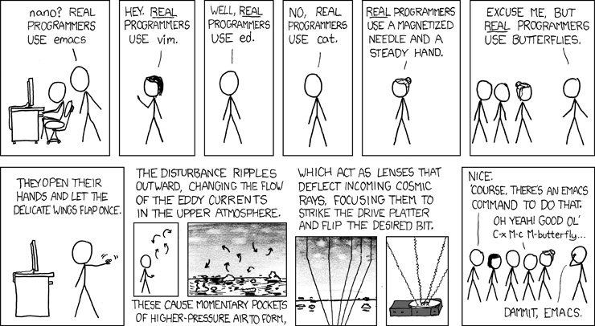
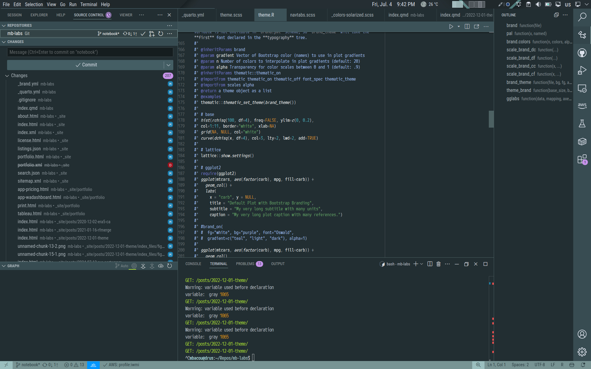
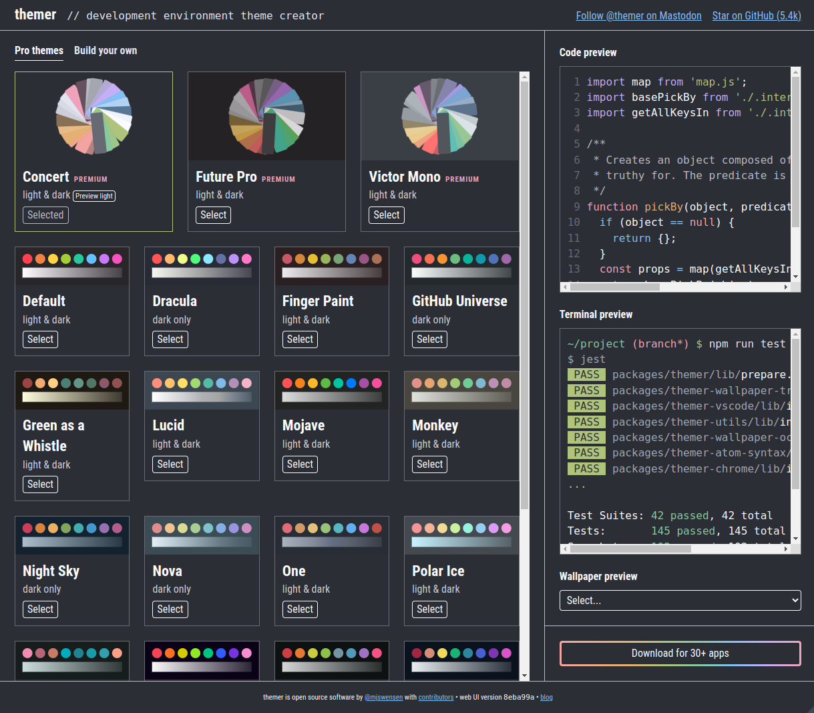

With the release of **Quarto 1.4** (in 2023), markdown-based publishing is gaining popularity, way beyond the scientific community. Multilingual text-based publishing formats (such as **Emacs org-mode**, **Rmarkdown** and **Jupyter** notebooks) that combine executable code chunks with formatted prose greatly simplify the process of drafting, iterating, compiling, documenting, sharing and reproducing computable research experiments..

Old-time researchers[^1] [^2] and engineers have long used [Emacs `Org-Mode`](https://orgmode.org/) (along with its wild hordes of keyboard shortcuts) to achieve similar results thanks to *Eric Schulte*'s incredible **Babel** extension [see @schulte2012] and to *John MacFarlane*'s [Pandoc](https://pandoc.org/) document converter library -- but nowadays **Quarto** makes use of more efficient script parsers and optimized runtime engines (Sass, Deno, V8) as well as **in-browser real-time rendering of documents**.

In the process of migrating old articles and code notebooks to the Quarto markdown syntax, I used this article as a template to build a complete Bootstrap theme for the revamped website. This article helped me finetune content placement and notebook execution. Feel free to reuse my `mbacou/mb-article` Quarto extebsion and other tidbits.

[^1]: For folks born this century, to **babel** (elips) or to **sweave** (R) is the process of compiling text documents that include both static markup and compile-time executable scripts.

    {.rounded-circle .d-block .mx-auto}

    The concept of **Literate programming** was introduced in 1984 by the mathematician [Donald Knuth](https://en.wikipedia.org/wiki/Donald_Knuth) and was widely popularized thereafter in the engineering community thanks to [org-mode](https://orgmode.org/worg/org-contrib/babel/uses.html) in the Emacs editor.

    {.rounded-circle .d-block .mx-auto}

    Emacs **`Org-Mode`** was created by the astronomer [Carsten Dominik](https://en.wikipedia.org/wiki/Org-mode#:~:text=Org%20Mode%20was%20created%20by,mode%20by%20default%20since%202006) in 2003 and remains to this day one of the most used and madly loved note-taking and GTD (Get-Things-Done) tools, with many of its functionality (agenda, tags, etc.) yet to be ported to any markdown engine.

[^2]: Only keyboard, Baby!

    {.lightbox}

# CSS Grid System

One of Quarto's many great features is the full flexibility of the [Bootstrap v5.3](https://getbootstrap.com/docs/5.3/getting-started/) responsive grid system, with a few handy classes to help precisely position content in a document or on a web page. In particular Quarto now provides:

-   3 predefined (column-based) page layouts:
    -   `page-layout: full` (home page)
    -   `page-layout: article` (this document), and
    -   `page-layout: custom` to use Boostrap CSS grid system
-   6 column classes to control content width (shown below)
-   2 margin classes to shift content into the left or right column (like that XKCD comics):
    -   `<div class="column-margin">`, and
    -   `<span class="aside">`
-   8 classes to overflow content into the left or right column

For example I use Quarto `.column-page` CSS class to place a flushed banner directly below the post header section, as a way to highlight static or dynamic content. Here is the R code chunk to achieve this, which generates a `<div class="column-page">` element, similar to the map above.

```r
#| column: page
#| eval: false

library(leaflet)
leaflet(width="100%", height="15em") %>% addTiles() %>%
  addMarkers(-8.65406047010657, 41.14426475811268, 
    label="Me, as I'm writing this post. Read on, tips below!", 
    labelOptions=labelOptions(textsize="1rem"))
```

Grid sizing and spacing are defined in `_quarto.yml` and may also be modified on a per-document basis, for example by setting:

```{yaml}
#| filename: ./_quarto.yml
#| eval: false

format:
  html:
    grid:
      body-width: 840px
      sidebar-width: 180px
      margin-width: 240px
      gutter-width: 30px
```

There are new Quarto CSS classes to help control content width and placement.

::: {.column-body .bg-info-subtle .mb-2}
`.column-body`
:::

::: {.column-body-outset .bg-info-subtle .mb-2}
`.column-body-outset`
:::

::: {.column-page .bg-info-subtle .mb-2}
`.column-page`
:::

::: {.column-page-inset .bg-info-subtle .mb-2}
`.column-page-inset`
:::

::: {.column-screen .bg-info-subtle .mb-2}
`.column-screen`
:::

::: {.column-screen-inset-shaded .mb-4}
`.column-screen-inset-shaded`
:::

Finally any layout is achievable using stackable `<div class="g-col-{width}">` CSS-Grid columns inside `<div class="grid">` elements (see color boxes below). The full system summarized here, copied straight from Quarto's online reference[^3].

[^3]: Refer to section [CSS classes](https://quarto.org/docs/authoring/article-layout.html#available-columns) in the official Quarto documentation.

::: {.column-page-right}
+----------------+-----------------------------+-----------------------------+
| Column         | Code Cell `column`          | Class Name                  |
+================+=============================+=============================+
| `Body`         | ```                         | ```                         |
|                | column: body                | .column-body                |
|                | column: body-outset         | .column-body-outset         |
|                | column: body-outset-left    | .column-body-outset-left    |
|                | column: body-outset-right   | .column-body-outset-right   |
|                | ```                         | ```                         |
+----------------+-----------------------------+-----------------------------+
| `Page Inset`   | ```                         | ```                         |
|                | column: page-inset-left     | .column-page-inset-left     |
|                | column: page-inset-right    | .column-page-inset-right    |
|                | ```                         | ```                         |
+----------------+-----------------------------+-----------------------------+
| `Page`         | ```                         | ```                         |
|                | column: page                | .column-page                |
|                | column: page-left           | .column-page-left           |
|                | column: page-right          | .column-page-right          |
|                | ```                         | ```                         |
+----------------+-----------------------------+-----------------------------+
| `Screen Inset` | ```                         | ```                         |
|                | column: screen-inset        | .column-screen-inset        |
|                | column: screen-inset-shaded | .column-screen-inset-shaded |
|                | column: screen-inset-left   | .column-screen-inset-left   |
|                | column: screen-inset-right  | .column-screen-inset-right  |
|                | ```                         | ```                         |
+----------------+-----------------------------+-----------------------------+
| `Screen`       | ```                         | ```                         |
|                | column: screen              | .column-screen              |
|                | column: screen-left         | .column-screen-left         |
|                | column: screen-right        | .column-screen-right        |
|                | ```                         | ```                         |
+----------------+-----------------------------+-----------------------------+
| `Margin`       | ```                         | ```                         |
|                | column: margin              | .column-margin / .aside     |
|                | ```                         | ```                         |
+----------------+-----------------------------+-----------------------------+
:::

Note that this table stretches across the right column thanks to Quarto `.column-page-right` CSS class.

::: {.aside .note .mt-md-4}
No other reason for this map but to showcase Quarto's new content layout features -- this margin note has classes `.aside.note`, the map itself has classes `column-page-left` to demonstrate the use of Quarto and Bootstrap's CSS utilities.

This margin column is **responsive**, content will be moved to the body column on smaller display sizes.

I am a fan of Soviet-era classic topo styles. Check out Russian [cartography](https://sovietmaps.com/), it is stunning work.
:::

```{r}
#| column: page-left
#| echo: fenced

library(leaflet)
leaflet(
  width = "100%",
  height = "17rem",
  options = leafletOptions(minZoom = 11, maxZoom = 13)
) %>%
  addTiles(
    "https://maps.vlasenko.net/?lon={x}&lat={y}",
    "sovietmap.com"
  ) %>%
  addMarkers(
    -8.65406047010657,
    41.14426475811268,
    label = "In Porto while <br/>working on migration.<br/> Read on, tips below...",
    labelOptions = labelOptions(textsize = "1rem")
  )
```

# Color Scheme

Bootstrap works best with a limited set of **8 semantic color names**. These are well known to Web designers, and for portability's sake it is advised to work within this standard and thus avoid complex naming. Optionally Bootstrap provides classes for an additional [10 + 4 colors](https://getbootstrap.com/docs/5.3/customize/color/#theme-colors) in both **opaque** and **subtle** variants. Most corporate brands stick to a handful of colors, but having a complete categorical palette is useful for more intricate graphical elements and for plots.

Choosing a color scheme is relatively easy -- for example start from your favorite photo or graphic and upload it to one of the many on-line **color palette generators** to extract dominant shades. An alternative is to use a professionally curated **R palette**, such as one available in the `paletteer`, `RBrewer` or `viridis` packages. See [r-charts.com](https://r-charts.com/color-palettes/) for many such examples.

Below I settled for a 12-color palette that simply matches my decade-old [Kubuntu desktop](https://store.kde.org/p/1980663)[^4].

[^4]: KDE, 30 years later, still going strong! My personal KDE color scheme in QGIS and VSCode.

    {.lightbox}

    {.lightbox}

Another remarkable tool I have used to generate sensible UI color schemes is [themer.dev](https://themer.dev/)[^5] -- this masterpiece of a library is designed to generate consistent color schemes across Linux desktops and for many consoles, text editors, and IDEs. Check it out!

[^5]: Development environment theme creator

    {.lightbox}

Moreover as of **Quarto v1.6**, the engine now supports externally-defined branding elements (colors, fonts, etc.) provided in standalone `_brand.yml` files. This is a more unified and flexible approach to organizing document- and project-level branding across multiple output formats[^6].

[^6]: The good folks at Posit further documented this [new feature](https://posit-dev.github.io/brand-yml/).

Note that `_brand.yml` definitions can also apply branding to `ggplot2`, `base R`, and `lattice` plots via the (recently released) `brand.yml` R package. However, I generally prefer to use my own branding utilities (see R package `mbutils`).

Below is the `_brand.yml` config file used on this website.

```{yaml}
#| file: ../../_brand.yml
#| filename: _brand.yml 
#| eval: false
```

My active Bootstrap color palette rendered below.

```{r}
#| classes: preview-image
#| label: preview-image

par(bg = "transparent")
yaml::read_yaml("../../_brand.yml")$color$palette |>
  unname() |>
  unlist() |>
  scales::show_col()
```


# Bringing it altogther: Quarto Format Extension

The final Quarto format was released under its own extension, named `mb-article`. To use in your own documents, simply install the extension with:

```bash
quarto use template mbacou/mb-article
```

And to update the extension thereafter:

```bash
quarto update template mbacou/mb-article
```

# Publishing Workflow

Finally, the latest Quarto release adds perfectly sensible options to optimize everyone's publishing workflow, in particular through the use of **Draft** and **Freeze** behavior:

-   `draft: true`

    Tells Quarto that a document may (or may not) be listed / accessible to viewers, and prevents automatic re-tangling.

-   `freeze: true`

    Tells Quarto to only re-tangle a document on content change, and not every time a site is rebuilt.
